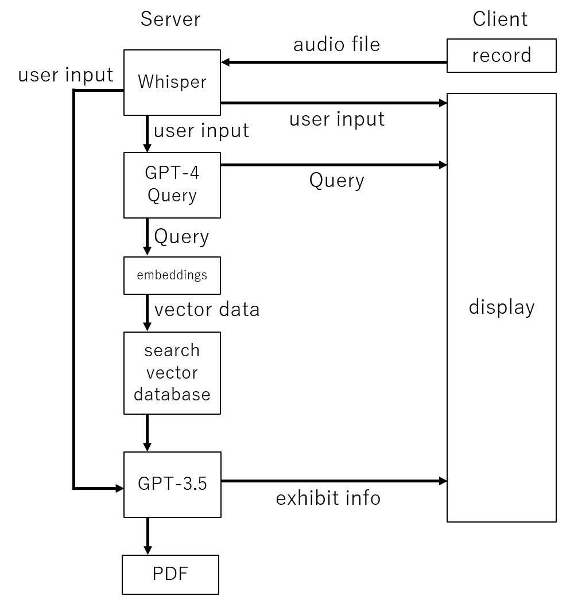

# museum-machikane

ミュージアム同好会のまちかね祭プロジェクト

フロントエンド(Unity)側の実装に関しては[こちら](https://github.com/TANIGUCHIREI/unity_for_museum_club)に記載しています。

## 概要

ユーザーの入力をもとにおすすめのミュージアムを検索するアプリケーション

## 全体の仕組み

フロントエンドはUnityで、バックエンドはpythonで実行しています。
アプリの概要としてはユーザーからの入力を音声またはテキストで受け入れ、
それをもとにChatGPTでクエリーを作成します。
このクエリーをopenaiのtext-embedding-ada-002でベクトルデータ化し、
作成しておいたミュージアムのベクトルデータベースから検索します。
検索の上位n個をさらにChatGPTに入力し、最終的におすすめのミュージアムを決定し、
おすすめの理由も考えてもらいます。
その結果をもとにPDFを作成し、自動で印刷する仕組みになっています。

## 採用している技術

フロントエンド：Unity

音声認識：whisper

ベクトルデータ化：openaiのtext-embedding-ada-002

生成AI：openaiのGPT-3.5 & GPT-4

Unityとの通信：websockets

## 優先順位

1. ~~データベースの作成~~
2. ~~検索の実装~~
3. ~~当選機能の実装~~
4. ~~プリンターで印刷する機能の実装~~
5. ~~プリントするPDFの作成~~
6. ~~Unityとの統合~~
7. ~~音声入力の実装~~
